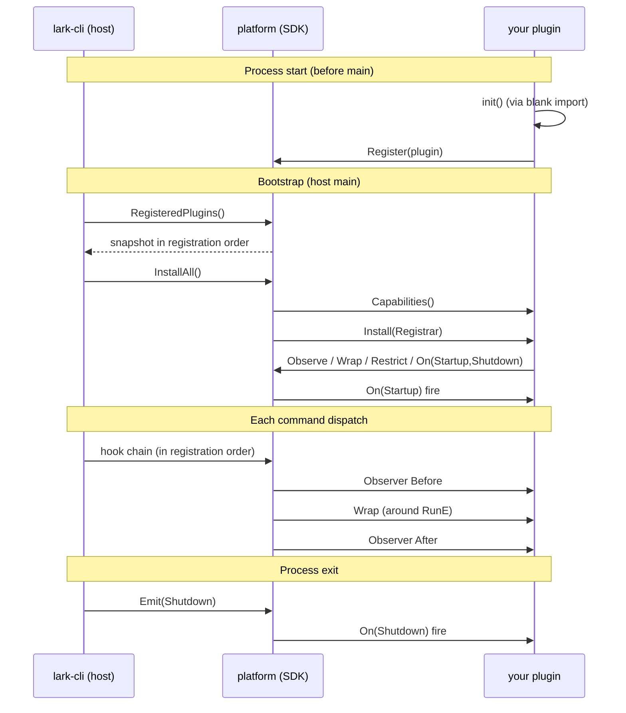

# lark-cli Plugin SDK

`extension/platform` is the **in-process plugin SDK** for lark-cli.
Plugins compile into a **fork** of the lark-cli binary via a blank
import; there is no `.so` loading, no RPC, no subprocess isolation.
A plugin shares the binary's address space and lifecycle.

## 5-minute hello world

```go
// myplugin/audit.go
package myplugin

import (
    "context"
    "log"

    "github.com/larksuite/cli/extension/platform"
)

func init() {
    platform.Register(
        platform.NewPlugin("audit", "0.1.0").
            Observer(platform.After, "log-cmd", platform.All(),
                func(ctx context.Context, inv platform.Invocation) {
                    log.Printf("cmd=%s err=%v", inv.Cmd().Path(), inv.Err())
                }).
            FailOpen().
            MustBuild())
}
```

Wire into a fork:

```go
// cmd/larkx/main.go in your fork
package main

import (
    _ "github.com/me/myplugin"  // blank import → init() runs

    "github.com/larksuite/cli/cmd"
    "os"
)

func main() { os.Exit(cmd.Execute()) }
```

```sh
go build -o larkx ./cmd/larkx && ./larkx config plugins show
```

You should see `audit` in the plugin list.

## What you can hook

| Hook                       | Fires                              | Can block?                       |
| -------------------------- | ---------------------------------- | -------------------------------- |
| `Observer`                 | Before / After each command        | No (fire-and-forget audit)       |
| `Wrap`                     | Around each command's RunE         | Yes (return `*AbortError`)       |
| `On(Startup/Shutdown)`     | Process lifecycle                  | N/A                              |
| `Restrict(Rule)`           | Bootstrap-time, single per binary  | Denies whole subtrees            |

### Plugin lifecycle



A `command_denied` decision (from `Restrict` or strict-mode) bypasses
the `Wrap` chain entirely — observers still fire so audit plugins see
the rejected dispatch.

## Safety contract (read this)

- A plugin calling `Restrict()` MUST declare `FailClosed`. The Builder
  flips it automatically; the lower-level `Plugin` interface rejects
  the mismatch with `restricts_mismatch`.
- Only ONE plugin per binary can call `Restrict()`. Multi-plugin
  Restrict is a deliberate `plugin_conflict` error (single-rule
  ecosystem assumption). YAML policy at `~/.lark-cli/policy.yml` is
  shadowed by any plugin Restrict.
- The `Wrap` factory runs **once per command dispatch**, not at
  install time. Long-lived state (clients, caches, metrics counters)
  must live on the Plugin struct or in package-level variables.
- Plugins cannot suppress a `command_denied`: the framework
  physically isolates denied commands from the Wrap chain (Observers
  still fire).
- Commands missing a `risk_level` annotation are denied by default
  when a Rule is active. Set `Rule.AllowUnannotated = true` (or
  `allow_unannotated: true` in yaml) to opt out during gradual
  adoption.
- Risk annotation typos (e.g. `"wrtie"`) are always denied with
  `risk_invalid` plus a "did you mean" suggestion. `AllowUnannotated`
  does NOT bypass this — typo is a code bug, not a missing
  annotation.

## reason_code reference

Every install / dispatch failure emits a `command_denied` or
`plugin_install` envelope carrying a `detail.reason_code` from the
closed enum below. Use the code (not the human-readable message) when
matching errors in agents, CI scripts, or downstream tools — the
messages are localised and may change between releases.

### Plugin install (`error.type = plugin_install`)

| reason_code                 | When it fires                                                                  | Honours FailurePolicy? |
| --------------------------- | ------------------------------------------------------------------------------ | ---------------------- |
| `invalid_plugin_name`       | `Plugin.Name()` doesn't match `^[a-z0-9][a-z0-9-]*$`                           | No — always aborts     |
| `plugin_name_panic`         | `Plugin.Name()` panicked                                                       | No — always aborts     |
| `duplicate_plugin_name`     | Two plugins return the same `Name()`                                           | No — always aborts     |
| `capabilities_panic`        | `Plugin.Capabilities()` panicked                                               | Yes                    |
| `invalid_capability`        | `Capabilities` malformed: bad `RequiredCLIVersion`, unknown `FailurePolicy`    | No — always aborts     |
| `capability_unmet`          | Current CLI version doesn't satisfy `RequiredCLIVersion`                       | Yes                    |
| `restricts_mismatch`        | `Restricts=true` without `FailClosed`, or `Restricts` flag inconsistent w/ Install | No — always aborts |
| `invalid_hook_name`         | Hook name contains `.` or doesn't match the plugin namespace                   | Yes                    |
| `duplicate_hook_name`       | Same hook name registered twice within a plugin                                | Yes                    |
| `invalid_hook_registration` | Hook factory returns nil / Wrap chain re-entry / etc.                          | Yes                    |
| `invalid_rule`              | Rule fails ValidateRule (malformed glob, bad MaxRisk, unknown Identity)        | Yes                    |
| `double_restrict`           | Plugin called `r.Restrict()` more than once in one Install                     | Yes                    |
| `multiple_restrict_plugins` | Two or more plugins each contributed Restrict                                  | Yes                    |
| `install_failed`            | `Plugin.Install` returned a non-nil error                                      | Yes                    |
| `install_panic`             | `Plugin.Install` panicked                                                      | Yes                    |

"No — always aborts" entries are treated as **untrusted-config errors**:
the host can't honour the plugin's declared `FailurePolicy` because the
declaration itself is suspect (e.g. an `invalid_capability` plugin
might also be lying about being `FailOpen`).

### Command dispatch (`error.type = command_denied`)

| reason_code             | Meaning                                                                                                          |
| ----------------------- | ---------------------------------------------------------------------------------------------------------------- |
| `risk_not_annotated`    | Command has no `risk_level` annotation, and the active Rule does not set `allow_unannotated: true`               |
| `risk_invalid`          | Command's `risk_level` is a typo / not in the `read | write | high-risk-write` taxonomy (always fail-closed)     |
| `command_denylisted`    | Command path matched the active Rule's `deny` glob                                                               |
| `domain_not_allowed`    | Active Rule has a non-empty `allow` list and the command path did not match any glob                             |
| `write_not_allowed`     | Command risk is `write` / `high-risk-write` and exceeds Rule `max_risk`                                          |
| `risk_too_high`         | Command risk exceeds Rule `max_risk` but is not a write (reserved for future risk levels)                        |
| `identity_mismatch`     | Command's `supportedIdentities` does not intersect Rule `identities`                                             |
| `aggregate_all_denied`  | Aggregate stub installed on a parent group because every live child was denied                                   |

The `detail.layer` field distinguishes who rejected the call:
`policy` (this SDK's user-layer engine) vs. `strict_mode`
(`cmd/prune.go`'s credential-hardening pass). Agents that want to
dispatch on "any denial" should match `error.type == "command_denied"`
and ignore the layer; agents that only care about user-policy denials
should additionally check `detail.layer == "policy"`.

## Where to go next

- [Runnable example: audit observer](./examples/audit-observer/)
- [Runnable example: read-only policy](./examples/readonly-policy/)
- Builder API: see [`builder.go`](./builder.go) for the full DSL
  (`NewPlugin`, `Observer`, `Wrap`, `Restrict`, `FailOpen`/`FailClosed`,
  `MustBuild`).
- Inventory diagnostic: run `lark-cli config plugins show` after
  installing your plugin to see hooks/rules attributed to your plugin
  name.
