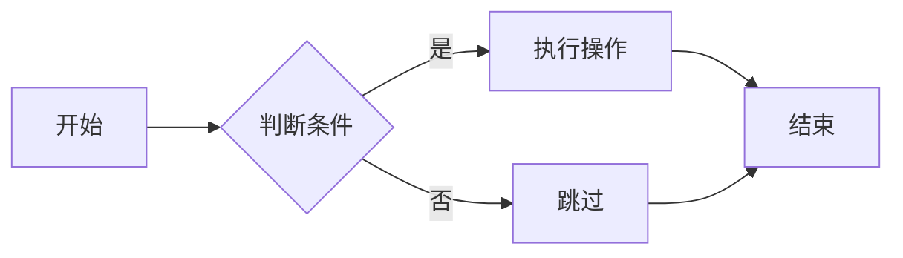
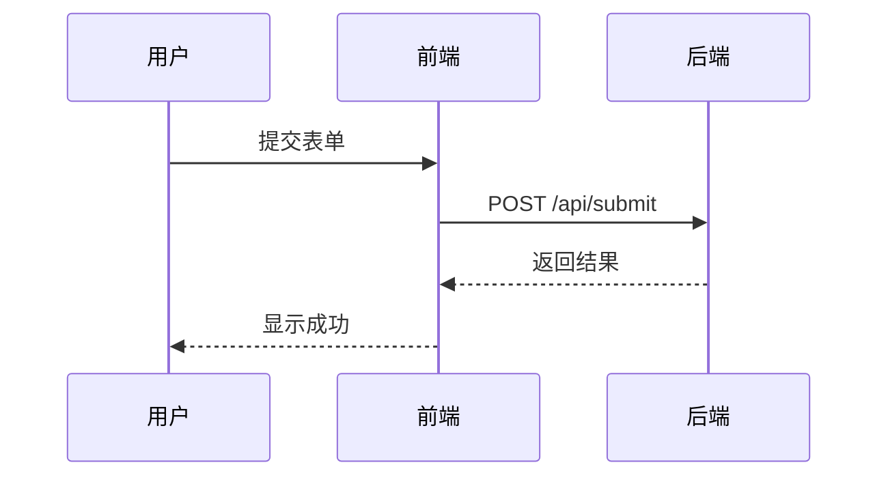
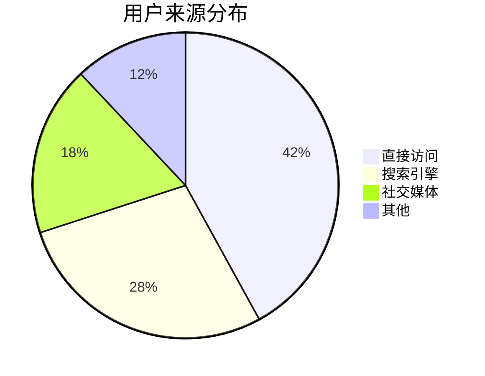
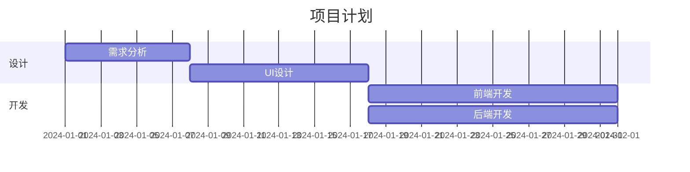
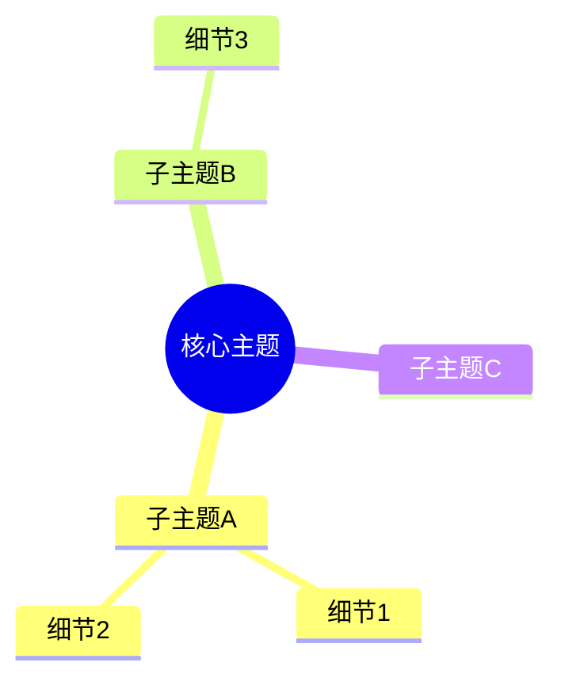

# Whiteboard 画板元素

`<whiteboard>` 放在 `<data>` 内，内部可放 **SVG** 或 **Mermaid** 图表，用于绘制数据图表、流程图、时序图、架构图及装饰性图案等 `<shape>` / `<line>` 难以覆盖的视觉内容。

---

## ⚠️ 设计品质要求（必读）

在 slide 里嵌入 `<whiteboard>` 的目的是**提升视觉质量**，不是把数字堆进去。

- **不要只用矩形加文字应付**：通篇纯白底色 + 方块 + 黑字等于白做，这是不及格输出
- **数据图表必须有坐标系**：坐标轴、网格线、数值标注缺一不可，不要只画柱子或点
- **字号必须有层级**：标题 ≠ 标签 ≠ 数值，混用同一字号会消灭视觉焦点
- **配色要与 slide 主题呼应**：深色 slide 背景下图表用透明底或深色卡片；浅色背景下避免再加纯白底块
- **每个 whiteboard 都是设计机会**：主动用圆角、半透明填充、折线面积、点装饰等细节拉开与默认模板的差距

---

## SVG 还是 Mermaid？

选择分两步：**先看图表类型，再看当前模型身份**。

### 第一步：图表类型优先判断

以下类型**推荐 Mermaid**，自动布局、代码简洁；如需精确匹配品牌配色或自定义节点样式，可改用 SVG：

| 图表类型 | Mermaid 关键字 |
|----------|--------------|
| 流程图、决策树、架构图 | `flowchart TD` / `flowchart LR` |
| 时序图 | `sequenceDiagram` |
| 类图 | `classDiagram` |
| 饼图 | `pie` |
| 甘特图 | `gantt` |
| 状态图 | `stateDiagram-v2` |
| 思维导图 | `mindmap` |
| ER 图 | `erDiagram` |

### 第二步：数据图表与装饰元素按模型身份选路径

上表以外的场景（柱图、折线图、进度条、时间线、波浪背景、星点纹理等）需要精确控制坐标和配色，SVG 表达力更强，但各模型生成 SVG 的能力有差异：

| 模型身份 | 路径 |
|----------|------|
| Claude / Gemini / GPT / GLM | **SVG** — 精确控制坐标、颜色、透明度 |
| Doubao / Seed / Other | **Mermaid** — 用 `pie`、`gantt` 等近似表达；确实无法用 Mermaid 表达时才回退到简单 SVG 矩形/线条 |

> **先自报身份再选路径**：在决定使用 SVG 之前，确认当前模型属于哪一类。不要跳过这一步。

---

## 模式一：SVG

### 语法

```xml
<whiteboard width="400" height="300" topLeftX="500" topLeftY="120">
  <svg width="400" height="300" viewBox="0 0 400 300" xmlns="http://www.w3.org/2000/svg">
    <rect x="50" y="50" width="80" height="200" rx="4" fill="rgba(59,130,246,0.85)"/>
    <text x="90" y="270" text-anchor="middle" font-size="12" fill="rgba(100,116,139,1)">ABC</text>
  </svg>
</whiteboard>
```

**SVG 属性要求：**
- `width` / `height`：SVG 自身的渲染尺寸，通常与 whiteboard 相同，但可以不同（`viewBox` 控制内容缩放）
- `viewBox`：定义 SVG 内坐标系范围，如 `0 0 400 300`；与 `width`/`height` 不同时，内容会等比缩放
- `xmlns`：`http://www.w3.org/2000/svg`

### 支持的 SVG 元素

| 元素 | 说明 | 典型用途 |
|------|------|---------|
| `<rect>` | 矩形，支持 `rx` 圆角 | 柱图、卡片、进度条 |
| `<circle>` | 圆 | 节点、装饰点、环形图 |
| `<ellipse>` | 椭圆 | 自定义轮廓图形 |
| `<line>` | 直线 | 坐标轴、分隔线 |
| `<path>` | 任意路径（支持 Q/C 曲线） | 波浪、折线、弧形 |
| `<text>` | 文本，支持中文 | 标签、数值 |
| `<polygon>` | 多边形 | 箭头、星形、面积填充 |
| `<g>` | 分组 | 批量变换、语义分组 |

**颜色：** 统一用 `rgba(R,G,B,A)`，对深浅背景都友好。  
**虚线：** `stroke-dasharray="4,4"` 用于网格线 / 坐标轴。  
**变换：** `transform="translate(x,y)"` / `rotate(deg cx cy)` / `scale(n)` 均支持。

### 布局模式

**全屏装饰层（置于 shape 之前 → 在下层）**
```xml
<whiteboard width="960" height="540" topLeftX="0" topLeftY="0">
  <svg width="960" height="540" viewBox="0 0 960 540" xmlns="http://www.w3.org/2000/svg">
    ...
  </svg>
</whiteboard>
```

**侧栏图表（与文字 shape 并排）**
```xml
<!-- 左侧文字 -->
<shape type="text" topLeftX="60" topLeftY="120" width="500" height="340">...</shape>
<!-- 右侧图表 -->
<whiteboard width="340" height="340" topLeftX="580" topLeftY="120">
  <svg width="340" height="340" viewBox="0 0 340 340" xmlns="http://www.w3.org/2000/svg">
    ...
  </svg>
</whiteboard>
```

**底部装饰条**
```xml
<whiteboard width="960" height="100" topLeftX="0" topLeftY="440">
  <svg width="960" height="100" viewBox="0 0 960 100" xmlns="http://www.w3.org/2000/svg">
   ...
  </svg>
</whiteboard>
```

---

### 禁止使用的 SVG 特性

以下特性在 slide `<whiteboard>` 渲染端不支持或行为不可预测，必须避免：

| 禁止 | 原因 | 替代方案 |
|------|------|---------|
| `<radialGradient>` / `<linearGradient>` | 渲染失败 | 用 `rgba()` 透明度模拟深浅层次 |
| `<filter>`（阴影、模糊等） | 渲染失败 | 用半透明 `<rect>` 叠加模拟阴影 |
| `<clipPath>` / `<mask>` | 渲染失败 | 调整元素坐标和尺寸自然裁切 |
| `<pattern>` | 渲染失败 | 手动铺 `<circle>` / `<rect>` 点阵 |
| `skewX` / `skewY` / `matrix(...)` | 空间扭曲，降级渲染 | 用 `rotate` + `translate` 替代 |
| `<image>` 外链 URL | 不支持外链 | 先上传得到 file_token，再用 `` 元素 |

---

### 坐标计算

含数据映射的图表（柱状图、折线图等），坐标值用脚本计算后再填入 SVG，**禁止直接拍像素**。

```js
// node calc_coords.js  ← 运行后把输出粘贴到 SVG 注释，再写元素
const W = 360, H = 260
// 自行决定图表区域起点和尺寸（为轴标签、标题留出空间）
const originX = 50, originY = 216   // 图表左下角
const cW = 290, cH = 184            // 图表宽高

const data = [120, 160, 90], yMax = 200
const svgY = v => originY - (v / yMax) * cH
const barW = Math.floor(cW / data.length * 0.62)

data.forEach((v, i) => {
  const cx = Math.round(originX + (i + 0.5) * cW / data.length)
  const y  = Math.round(svgY(v))
  const h  = Math.round(svgY(0) - y)
  console.log(`bar-${i}(${v}): x=${cx - barW/2 | 0} y=${y} w=${barW} h=${h}`)
})
```

折线图点坐标：`svgX(i) = originX + i/(n-1)*cW`，`svgY(v) = originY - (v-yMin)/(yMax-yMin)*cH`。

---

## 模式二：Mermaid

### 语法

```xml
<whiteboard topLeftX="72" topLeftY="60" width="816" height="360">
  <mermaid>
    <![CDATA[
        flowchart TD
            A[检查 lark-cli 与 jq] --> B[编写每页 slide XML]
            B --> C[通过 jq 生成 slides JSON]
            C --> D[执行 slides +create]
            D --> E[读取 xml_presentation_id]
            E --> F[回读并验证创建结果]
    ]]>
  </mermaid>
</whiteboard>
```

**关键点：**
- 内容用 `<![CDATA[...]]>` 包裹——Mermaid 语法里的 `[`、`>`、`-->` 是 XML 特殊字符，CDATA 避免转义问题
- whiteboard 只需 `topLeftX`、`topLeftY`、`width`、`height`，无需 SVG 相关属性
- `<mermaid>` 内不加 `xmlns`

### 支持的 Mermaid 图表类型

| 类型 | 关键字 | 适用场景 |
|------|--------|---------|
| 流程图 | `flowchart TD` / `flowchart LR` | 业务流程、决策树、工作流 |
| 时序图 | `sequenceDiagram` | 系统交互、API 调用链 |
| 甘特图 | `gantt` | 项目计划、里程碑 |
| 饼图 | `pie` | 占比数据 |
| 类图 | `classDiagram` | 对象关系、架构设计 |
| ER 图 | `erDiagram` | 数据库结构 |
| 状态图 | `stateDiagram-v2` | 状态机、生命周期 |
| 思维导图 | `mindmap` | 主题梳理、知识架构 |
| 用户旅程 | `journey` | 用户体验路径 |

### 常用 Mermaid 示例

**从左到右的流程图**


**时序图**


**饼图**


**甘特图**


**思维导图**


### Mermaid 布局建议

Mermaid 图表会自动撑满 whiteboard 区域。建议：
- 流程图留足高度，节点较多时适当增加 height（比如 400-480）
- 避免一页放超过 15 个节点，内容太密时考虑分页
- 推荐尺寸参考：

| 图表类型 | 建议 width | 建议 height |
|---------|-----------|------------|
| 流程图（5-8 节点） | 720-816 | 300-400 |
| 时序图（3-5 参与者） | 720-816 | 320-420 |
| 饼图 | 500-600 | 300-360 |
| 甘特图 | 816 | 280-360 |
| 思维导图 | 816 | 380-480 |

---

## whiteboard 公共属性

| 属性 | 必需 | 说明 |
|------|------|------|
| `topLeftX` | 是 | 左上角 X 坐标（slide 坐标系，slide 默认宽 960） |
| `topLeftY` | 是 | 左上角 Y 坐标（slide 坐标系，slide 默认高 540） |
| `width` | 是 | 画板宽度（像素） |
| `height` | 是 | 画板高度（像素） |

> SVG 模式需在 `<svg>` 上设置 `width`、`height`、`viewBox`、`xmlns`；`width`/`height` 通常与 whiteboard 相同，但可以不同——`viewBox` 控制内容坐标系，SVG 会自动缩放以适应 whiteboard 区域。Mermaid 模式不需要额外属性。

---

## 注意事项 & 已知问题

### z-order（SVG 模式）

whiteboard 在 XML 中的位置决定渲染层级：在 shape 前 → 在下层；在 shape 后 → 在上层。全屏装饰 whiteboard 应放在所有 shape 之前。

### Mermaid CDATA 必要性

Mermaid 语法包含 `[`、`>`、`-->`，不用 CDATA 直接写会破坏 XML 解析。始终使用 `<![CDATA[ ... ]]>`。

### 坐标系独立

SVG 内的坐标相对于 whiteboard 自身左上角（0,0），不是 slide 的坐标系。

---

## 快速自检清单

**SVG 模式——结构检查：**
- [ ] `<svg>` 设置了 `width`、`height`、`viewBox`、`xmlns`
- [ ] `topLeftX + width ≤ 960`，`topLeftY + height ≤ 540`
- [ ] 所有 SVG 元素坐标 + 尺寸在 viewBox 范围内（无溢出）
- [ ] 所有颜色用 `rgba()` 格式，无 `<linearGradient>` / `<filter>` / `<clipPath>`
- [ ] 文字 `y` 坐标为 baseline 位置，最小值 ≥ font-size（避免被裁切）

**SVG 模式——视觉品质检查：**
- [ ] 坐标轴、网格线、数值标注齐全，没有"裸柱子"或"裸折线"
- [ ] 字号有层级：标题 > 数值 > 轴标签，非全部相同
- [ ] 单一数据系列用同一颜色，多系列用不同颜色且对比充足
- [ ] 图表元素不超出 viewBox 边界，轴标签有足够空间
- [ ] 坐标推导有注释（写明 originX/Y、chartW/H、数据映射公式）

**Mermaid 模式：**
- [ ] 内容包在 `<![CDATA[...]]>` 内
- [ ] CDATA 结束符 `]]>` 不出现在 Mermaid 代码本身中
- [ ] `topLeftX + width ≤ 960`，`topLeftY + height ≤ 540`
- [ ] 节点数量合理（单图不超过 15-20 个节点）

**通用：**
- [ ] XML 标签全部闭合，属性引号完整
- [ ] 如果失败，检查是否是偶发 5001000，重试一次
